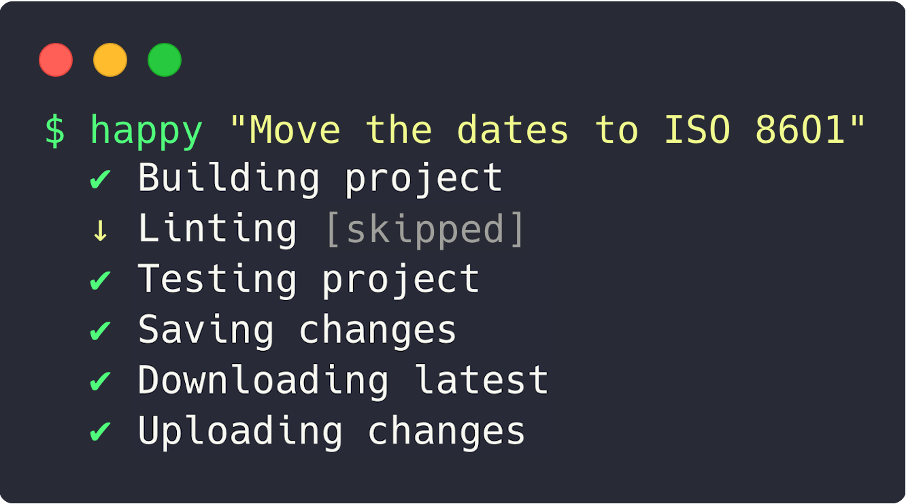

# Happy

Simplify 90% of your day-to-day Git workflow:

```
happy save
```



Basically, does these:

```bash
git add . -A
git commit -m "Commited on ${time()}"
git pull origin master
git push
```

Read the `index.js`, since this is a very alpha package and will change.
